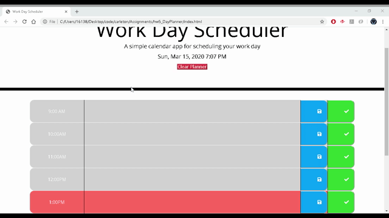

# Day Planner

This is homework #5 for the Carleton University Coding Boot Camp

It is built with HTML, CSS, and Javascript, utilizing moment.js

Check out the live version here - https://ryanjms.github.io/hw5_DayPlanner/

The day planner allows you to add tasks in the time blocks, and save them with the blue save button. And clear them (hopefully when complete) with the done button. You can also clear the planner using the top clear planner button.

The time blocks will change color depending on if they are past/present/future.

The gif below is a demonstration - 

